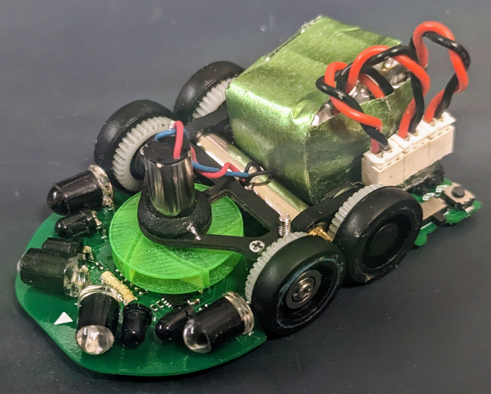
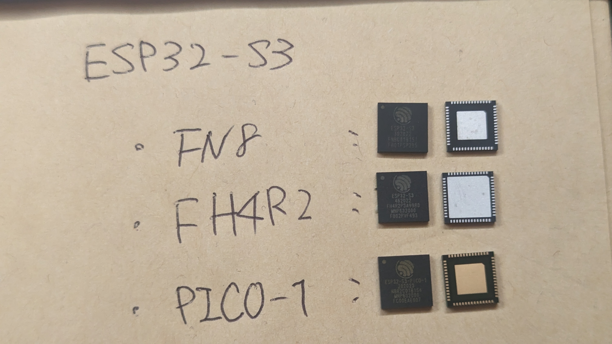
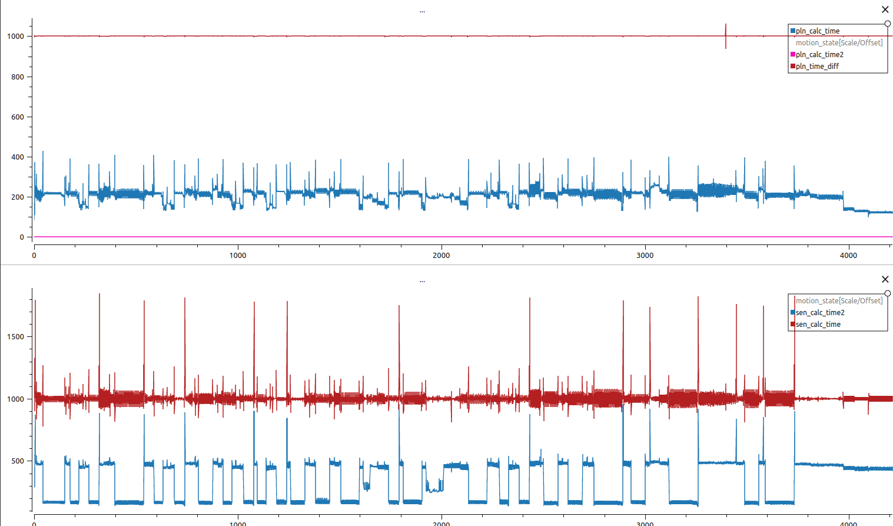

# Banshee
 
2022年全日本大会で突貫で2セル化したExiaSnowWhiteをベースに、正式な2セル機として作成したシリーズ。  
ExiaSnowWhiteでは電源周りのノイズに苦戦した反省から回路の見直しを実施。  
足回りについてはマイクロマウス合宿で発表した「ベアリングホルダー方式」を採用することで、足回りの剛性を強化。高速走行時の安定性につなぐことができた機体です。

このリポジトリでは、Bansheeで利用しているすべてのソースコードと基板のファイルを公開しています。

## 利用部品解説

### 1. CPU
ESP32-S3の以下の型番を利用
* ESP32-S3-FH4R2 (Banshee/BansheeAlter)
* ESP32-S3-PICO-1 (Banshee.SSS)

上記の2モデルは昨年発売されておらず、今シーズンから採用。  
昨年使用していたESP32-S3-FN8との違いはPSRAMが搭載で、2MBまでログを取得できるようになったことで細かい解析ができるようになった。

ESP32-PICO-1ではオシレーターの内蔵版となったことで部品点数削減につながった。

画像の通りパッドに違いがある。

#### 1.1 困ったこと
#### 1.1.1 FreeRTOSの固着
ESP32-S3ではデータシートにオシレーターの推奨回路が提示されているが、そのとおり実装すると、モーターを高Dutyで回した際に、FreeRTOSが停止するという問題が発生、推奨回路のコンデンサを除去することで解決した。

#### 1.1.2 データシートにないピンの初期値
書き込み時、電源投入時にHighを出力するピンが存在した。  
ESP32の他シリーズではデータシートに記載しているものもあるがS3では未記載である。
モータードライバにつながったピンに利用すると書き込み時にDuty100%で回転するなど、運用面の問題が発生するため回路の作り直しにつながった。

以下が問題のピン
* PIN26: GPIO20
* PIN28: GPIO26
* PIN44: GPIO39
> 他にもある可能性があり。

### 2. MotorDriver
* DRV8835  (Banshee/BansheeAlter)
* TB6614FNG (Banshee.SSS)

#### 2.1 DRV8835
多くの機体で採用されているが、その理由は以下の通り。
1. 小型ながら2A出力できるため、パフォーマンスが高い。
2. 内部抵抗が300mΩと低い
3. スイッチング周波数が最大250kHzと高く、モーターの特性に対応しやすい。
4. dead timeが100nsecと短いため、高めのPWM周波数に対応しやすい。
dead timeについては、大きい場合High-Lowの切り替えに時間がかかりすぎ、何も出力できないということがあり得る。同社の別のモータードライバでは同じような使い方をするとモーターが回らないということがあり得る。

しかし、最大定格が12Vまでであるため、3セル化には対応できないため、TB6614FNGに切り替えた。

### TB6614GNG
ディスコン部品であり、パッケージもSOP16と大きいが採用理由は以下の通り。
1. 定格が15Vと3セルに対応
2. 出力が瞬間最大4.5Aまで出力できる
3. スイッチング周波数が400kHzと非常に高く、モーターの特性に対応しやすい
4. dead timeが80nsecと短い

3セル化に伴い、クラシックで利用実績があったICであり、パワー勝負するために信頼できることから採用した。

### 3. PowerSupply
#### 3.1 LXDC55
2セル、3セルから直接3.3Vを取得する場合損失が大きく、熱による影響と効率の観点からDCDCコンバータを採用。入力側に容量が大きいコンデンサをつけないとノイズが乗りやすいため、高分子タンタルコンデンサを複数搭載。ノイズ問題は解決した。

約4.2Vを出力するよう、500Ωを利用。  

秋月にて購入できるため採用。

#### 3.2 MIC5319-3.3YM5
3.3V出力に利用。LEDの出力を大きくしたため、500mA出力できるこのICを採用。
データシート通り、バイパス用のピンに470pFのコンデンサをつけることでノイズの低減効果がある。

秋月にて購入できるため採用。

### 4. LED + PhotoTransistor
* LED:
  * OSI5FU3A11C
  * VSLY5940
* PhotoTransistor: LTR-4206E

BCR421UFD（低電流回路）を使った安定した出力をしていたが、
昨年の全日本大会では会場の照明が近いことから、環境ノイズの影響を大きく受けた。  
SN比が良くなるよう、高出力化できる＋LTR-4206Eの帯域に合う大型LEDを採用した

#### 5. gyro
LSM6DSRXTRを採用。4000deg/sec対応している点、昨年のExiaSnowWhiteから継続採用

#### 6. encoder
AS5147Pを採用。14bit対応+28000RPMまで対応しているため継続採用。

ベアリングホルダー方式ではエンコーダ基板に穴を開けることで位置決めしやすいした。

## システム解説

FreeRTOSを利用。  
ESP32-S3は2コア搭載しており、マイクロマウスでは一定周期で実行したい処理と非同期で実行したい処理が大きく分かれており、混在すると周期に乱れが生じてしまう点から、物理的に分けて利用することでシステム全体を滞りなく動かすことを狙った。

### 工夫
リアルタイムOSを利用しているとはいえ、タスクの優先順位次第では一定周期で処理できないことがある。エンコーダは前回値との差を使うため時刻差の影響を大きく受けた。

対策として、前回取得した時刻を記憶、現在時刻との差分から速度、距離の算出に利用したことで制御・判断の精度向上ができた。

### 課題

上記の画像は上側がplanning_task、下側がsensing_taskの処理時間(μsec)のログである。  
特にsensing_taskでは、定期的に1000μsecを大きく超え、周期が安定しないときが見られる。
また、planningのタスクの優先度を高く設定しているため、安定しているように見える。

原因は2つ判明しており、  
1つ目はmain_taskから要求される指示メッセージの処理不可が大きい点  
2つ目はセンサーに使用するAD変換に時間がかかる点  
である。

メッセージの送信自体が重くデータは構造体ではなく、ポインタを送信しているためデータ量に起因するものではないため、改善が難しい。
AD変換もESP32自体がIoT向けのマイコンである点からあまり得意でないことから改善が不可能である。

AD変換については、常にすべてのAD変換を行うのではなく、重要度の低いものは１回おきに取得することでシステム全体の負荷を下げるなどの工夫はしているが不十分な状況である。

いずれも今後発売予定のESP32-P4による性能向上に伴う改善を期待する。

## change log
1. Banshee
2. Banshee Alter
3. ~~(BansheeNorn)~~
4. Banshee.SSS　(latest)
