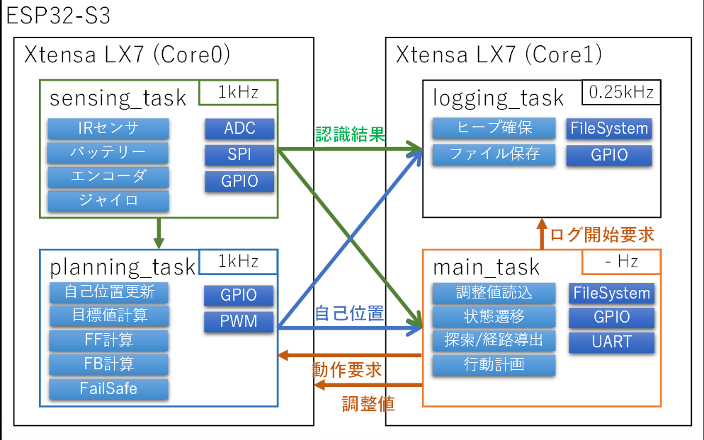

## Banshee Planning Simulink

BansheeのPlanningではmain_taskから要求された目標値(位置、角度)と制約(速度、加速度、角加速度など)をもとに指令値を算出するロジックをMatlab/Simulinkで実装しています。



## How to use

matlab_wsにて、`include`、`model`、`src`をサブフォルダを含めpathに追加し、`init.m`を実行。Figureが出たら完了。

`sim_mpc.slx`を開き実行すると、`init.m`で宣言した目標値をベースに指令値を算出するシミュレーションを実行する

モードは`init.m`のtest_modeで制御している（書き換えたら都度`init`を実行する必要あり）また、test_modeのコードを直接変更必要がある。

以下がモードです。
0. 直進
1. スラローム（オリジナル加速）
2. 超信地旋回
3. 後退
4. スラローム（固定加速度）

init後はsim_mpc.slxで実行し、各種速度、角速度などの指示値がどうなっているかscopeで確認する

## how to integration

`build_mpc_tgt_calc.m`を実行するとEmmbedd coderでコード生成し所定のフォルダに出力する。Bansheeではこのコードを参照、ビルドしやすいよう、シンボリックリンクにて参照関係を解決している。

## issue

`mpc_tgt_calc.slx`のIf1ブロックにて判断されるロジックが生成するコードにおいて、以下のコンパイルエラーとなるものが生成される。

```log
/home/naoto/Desktop/mouse/Banshee/main/gen_code_mpc/mpc_tgt_calc.cpp:584:40: error: suggest parentheses around '&&' within '||' [-Werror=parentheses]
  583 |   if (arg_mode == mpc_tgt_calc_P.Constant_Value_k || arg_mode ==
      |                                                      ~~~~~~~~~~~
  584 |       mpc_tgt_calc_P.Constant3_Value_i && (rtb_RelationalOperator1_g0 &&
      |       ~~~~~~~~~~~~~~~~~~~~~~~~~~~~~~~~~^~~~~~~~~~~~~~~~~~~~~~~~~~~~~~~~~
  585 |        rtb_NOT2)) {
      |        ~~~~~~~~~     
```

原因は&&と||を組み合わせて利用しているif文において、その優先順位が明確でないことによるものである。

コンパイラオプションで回避可能であるものの、明確な優先順位をつけないとコンパイラ次第で挙動が変わり得るものであることは確かである。

以下のように()を入れることで成立する。
```cpp
  if (arg_mode == mpc_tgt_calc_P.Constant_Value_k || (arg_mode ==
      mpc_tgt_calc_P.Constant3_Value_i && (rtb_RelationalOperator1_g0 &&
       rtb_NOT2))) {
```

> （流石にこれはコード生成上のガバでは？）